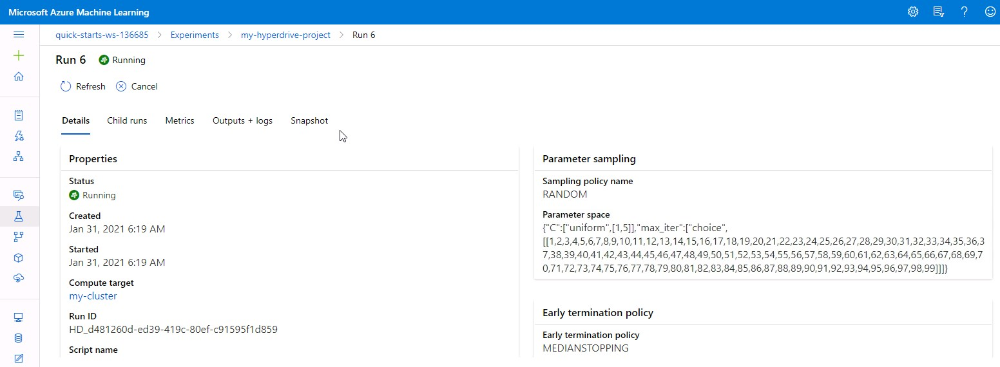

# Breast Cancer Prediction using Azure ML

This project is a part of Udacity's Azure ML Nanodegree. In this project, we aim to predict if a patient's tumour is Malignant or Benign using Microsoft Azure ML. For this purpose we use Breast Cancer Wisconsin dataset provided by UCI Machine Learning (made available on Kaggle).
This project is divided into 3 parts. 
* Initially we build and optimize an Azure ML pipeline using Python SDK and Logistic Regression Scikit-learn model for our dataset. Hyperparameters for this model are tuned using HyperDrive. 
* Later we execute an Azure AutoML run for the same dataset that generates a number of machine learning models. We compare the best model generated by AutoML with the model obtained in the first part and make a decision based on Accuracy.
* Finally we deploy the chosen model as a web service in Azure Container Instance. This service publishes a scoring URI and a primary key. We use this information to pass sample data to the web service and check if the output is as expected.

## Project Set Up and Installation
* Download dataset CSV file from Kaggle using link https://www.kaggle.com/uciml/breast-cancer-wisconsin-data
* Unzip BreastCancerPrediction.zip and extract project source files
* Start Microsoft Azure ML Studio in a browser and login using credentials provided
* Go to Datasets tab and create a new dataset with following details:
  - source : local file (choose CSV file downloaded earlier)
  - type : Tabular
  - name : "cancer-dataset"
  - datastore : default
  - select option to read column headers from the first file
* Go to Notebooks tab and upload all source files as well as the CSV file
* Create a compute to execute Python notebooks
* Execute hyperparameter_tuning.ipynb one step at a time. In the end you will get details of the generated model with primary metric Accuracy
* Execute automl.ipynb till the step where you get details of the best model generated
* Deploy the model with the best Accuracy. It will be deployed as a web service with authentication enabled and using Azure Container Instance.
* Go to endpoints tab and locate the deployed web service. Note scoring URI and primary key of the service.
* Open file endpoint.py and replace variables scoring_uri and key using information obtained from the web service
* Execute endpoint.py and confirm that it generates output in the form of [B] (for benign) or [M] (for malignant)

## Dataset
### Overview
We use Breast Cancer Wisconsin (Diagnostic) dataset. This dataset is available at https://www.kaggle.com/uciml/breast-cancer-wisconsin-data 

Key featue of this dataset as quoted on this website are as follows:
"Features are computed from a digitized image of a fine needle aspirate (FNA) of a breast mass. They describe characteristics of the cell nuclei present in the image. A few of the images can be found at http://www.cs.wisc.edu/~street/images/. Separating plane was obtained using Multisurface Method-Tree (MSM-T) [K. P. Bennett, "Decision Tree Construction Via Linear Programming." Proceedings of the 4th Midwest Artificial Intelligence and Cognitive Science Society, pp. 97-101, 1992], a classification method which uses linear programming to construct a decision tree. Relevant features were selected using an exhaustive search in the space of 1-4 features and 1-3 separating planes. The actual linear program used to obtain the separating plane in the 3-dimensional space is that described in: [K. P. Bennett and O. L. Mangasarian: "Robust Linear Programming Discrimination of Two Linearly Inseparable Sets", Optimization Methods and Software 1, 1992, 23-34]." 

### Attribute Information:
* id
* diagnosis
* radius_mean
* texture_mean
* perimeter_mean
* area_mean
* smoothness_mean
* compactness_mean
* concavity_mean
* concave points_mean
* symmetry_mean
* fractal_dimension_mean
* radius_se
* texture_se
* perimeter_se
* area_se
* smoothness_se
* compactness_se
* concavity_se
* concave points_se
* symmetry_se
* fractal_dimension_se
* radius_worst
* texture_worst
* perimeter_worst
* area_worst
* smoothness_worst
* compactness_worst
* concavity_worst
* concave points_worst
* symmetry_worst
* fractal_dimension_worst
    
Missing attribute values: none

Class distribution: 357 benign, 212 malignant

### Task
We aim to predict if the given sample is benign or malignant using given information. For this purpose we use all features as they are important for the decision. Except Id and diagnosis, all feautures are numeric. Also there are no missing values. The result column is Diagnosis with two possible values : B for benign and M for malignant.

### Access
As mentioned in project setup and installation section, we download dataset CSV file from Kaggle using link https://www.kaggle.com/uciml/breast-cancer-wisconsin-data and create a new dataset named "cancer-dataset"(from local file) using the CSV file.

## Automated ML
We created a notebook automl.ipynb to take care of following:
* Create compute cluster if not already present

* Create and execute AutoML experiment with following configuration:
  - task = "classification"
  - training_data=dataset
  - label_column_name="diagnosis"   
  - path = project_folder
  - enable_early_stopping= True
  - featurization= 'auto'
  - experiment_timeout_minutes = 20
  - max_concurrent_iterations = 5
  - primary_metric = 'accuracy'

* Track the progress of the experiment using RunDetails widget

* Find out the best model created by AutoML and register it

### Results
AutoML experiment generated a number of models.

The best model generated was VotingEnsemble with Accuracy 0.98597

VotingEnsamble is an ensamble learning model. Creating ensembles can improve machine learning results by combining multiple iterations that may provide better predictions compared to a single iteration. VotingEnsamble is applicable to classification as well as regression. In case of classification it uses weighted average of predicted class probabilities. In case of regression it uses weighted average of predicted regression targets. Our current task needs prediction using classification. VotingEnsamble in Azure AutoML uses soft voting which provides prediction probability as weighted average of prediction probabilities of each model used in ensamble.

### Future Work
We can do following improvements to AutoML experiment:
* Configure the experiment to generatee model explanations. These can be used to find out top K features that affect the result

## Hyperparameter Tuning
We used Logistic Regression Scikit-learn model for the experiment of hyperparameter tuning. Logistic Regression is a type of classification model. It is easy to implement and efficient to train. It makes no assumptions about distribution of classes in feature space. It provides good accuracy for simple datasets. It is less inclined to overfitting, but it can overfit in high dimensional datasets. Also, it is tough to obtain complex relationships using Logistic Regression.

We chose following hyperparameters to be tuned:
* Regularization Strength 
* Max Iterations

We chose Random Parameter Sampling for following reasons:
* It supports discrete as well as continuous hyperparameters
* It supports early termination of low performance runs

We chose Median Stopping Policy for early stopping. It is an early stopping policy based on running averages of primary metrics reported by the runs. This policy computes running averages across all training runs and terminates runs with primary metric values worse than the median of averages.

Initially we created a training script train.py that takes Regularization Strength and Max Iterations as input. It takes care of following tasks:
* Get data from the dataset "cancer-dataset" that is already registered
* Split the dataset into test and train data
* Call scikit-learn LogisticRegression using given values of Regularization Strength and Max Iterations
* Create model file

Then we created a notebook hyperparameter_tuning.ipynb to take care of following:
* Create compute cluster if not already present

* Create and execute HyperDrive experiment with primary metric value "Accuracy" to tune hyperparameters using HyperDriveConfig that supplies training script along with other parameters

* Track the progress of the experiment using RunDetails widget

* Find out the best model created by HyperDrive and register it

### Results
HyperDrive run created a number of models with primary metric accuracy as follows:

As can be seen, the best model had Accuracy = 0.64361702 with Regularization Strength (C) = 3.67397699 and Max Iterations = 7.

### Future Work
We can do following improvements to hyperparameter tuning:
* Choose a different classification model like Decision Tree, K-nearest Neighbors (KNN) etc. 
* Choose a different early termination policy like Bandit Policy 
* Choose a different sampling method. e.g.
  - Do an initial search with Random Sampling and then refine the search space to improve results
  - Use Bayesian sampling

## Model Deployment
*TODO*: Give an overview of the deployed model and instructions on how to query the endpoint with a sample input.

## Screen Recording
*TODO* Provide a link to a screen recording of the project in action. Remember that the screencast should demonstrate:
- A working model
- Demo of the deployed  model
- Demo of a sample request sent to the endpoint and its response

## Standout Suggestions
*TODO (Optional):* This is where you can provide information about any standout suggestions that you have attempted.
